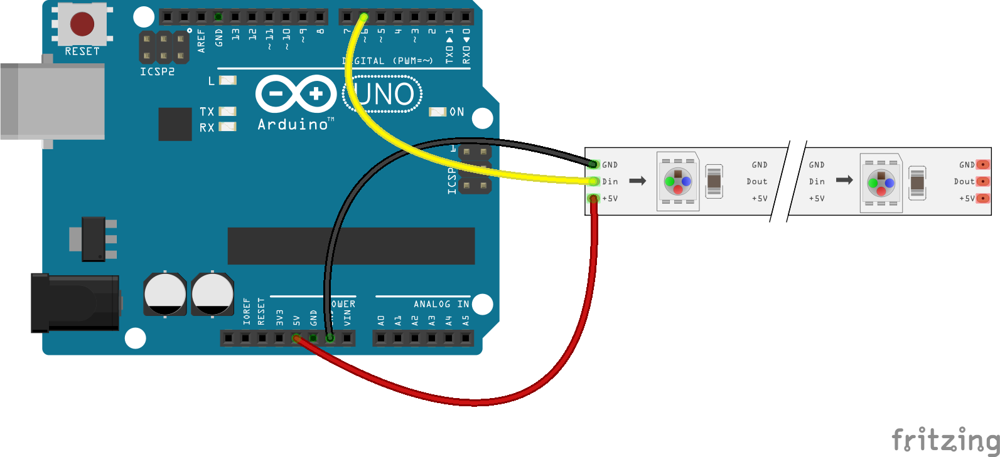

# NeoPixel NodeBots

## Installation

Clone this repo and then install basic dependencies (note Node 6+ is preferred):

```
git clone https://github.com/nodebotsau/workshops && cd workshops
cd neopixels
npm install
```

This will install:

* Node Red server that can be run locally (including contrib modules for Johnny
Five)
* Johnny Five (to interact with a local arduino)
* Interchange (so you can flash firmware to an arduino)
* NodePixel


### Install Node Pixel Firmata on your arduino.

From your project folder use interchange to flash node-pixel firmata onto your
arduino.

```
./node_modules/.bin/interchange install git+https://github.com/ajfisher/node-pixel -a uno --firmata -p /dev/tty.usbmodem1451
```

Noting that you may need to change the serial port address for your specific
machine setup.

### Using your NeoPixels

The basic circuit diagram is below:



Once running, you can interact with your neopixels in a few different ways.

Have a look at the examples in `node_modules/node-pixel` for programmatic examples
which you can run like this:

```
node node_modules/node-pixel/examples/johnny-five.js /dev/tty.usbmodem1451
```
[Also see the node-pixel README file](https://github.com/ajfisher/node-pixel/)

The rest of this document will use nodered.

## Running Node Red

To run node-red, `cd` to the root of your project folder then run:

```
./node-modules/.bin/node-red
```

And you will see Node Red spin up. If there are no errors you can access it
on [Localhost:1880](http://127.0.0.1:1880)

By default, contrib packages have been installed for:

* Johnny Five (GPIO nodes)
* MQTT
* Twitter

You can install more by simply npm-installing from your project folder and use
the packages that are provided at [http://flows.nodered.org/](http://flows.nodered.org/).


